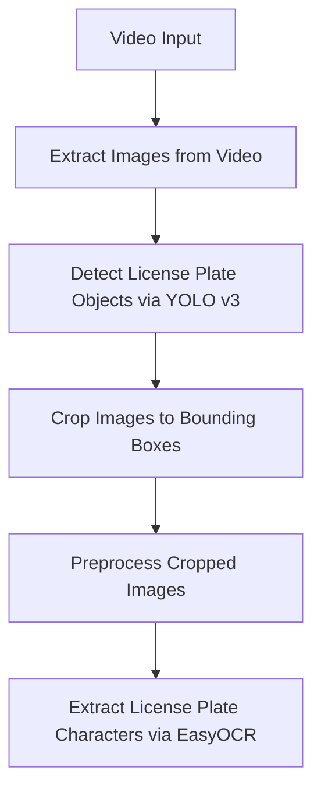
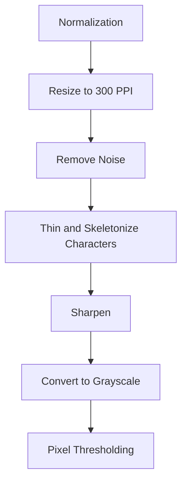

# System Design

## Motivation

### Why are we solving this problem? 

Recognizing the limitations and inefficiencies of manual toll collection, the Department of Transportation aims to improve traffic flow, reduce congestion, and streamline the tolling process by implementing a robust Automated License Plate Recognition (ALPR) system. I have been tasked with developing a machine learning-based ALPR system that is capable of capturing images of moving vehicles at toll booths and accurately recognizing and recording their license plates, which will be used to automatically charge tolls to the vehicles' registered owners.

This system will ensure a more seamless and secure toll collection process, improving the commuter experience and ultimately contributing towards a more sustainable, effective, and efficient transportation network.

### Why is our solution a viable one?

Machine learning is a viable choice for developing a robust and accurate Automated License Plate Recognition (ALPR) system due to its ability to effectively handle complex patterns and large datasets. An ALPR system requires the capacity to recognize diverse license plate formats, handle varying lighting and weather conditions, and adapt to a wide range of vehicle speeds. 

Machine learning algorithms excel in these scenarios as they can be trained on large datasets, allowing the system to learn and generalize patterns inherent in license plate images. Additionally, machine learning enables continuous refinement through feedback loops. As the ALPR system processes more data and encounters new license plate variations, the model can be fine-tuned to enhance accuracy and performance. This adaptability is crucial for ensuring the system's effectiveness across different geographic locations, weather conditions, and evolving license plate designs.

The scalability of machine learning also allows for efficient processing of vast amounts of data in real-time, enabling quick and accurate recognition of license plates at high speeds. Overall, the learning capabilities, adaptability, and scalability of machine learning make it a compelling choice for developing a reliable and precise ALPR system, meeting the complex demands of modern toll collection on highways.

## Requirements

### Scope
Our main goals are to test the viability of the provided object detection models and to design an OCR (Optical Character Recognition) pipeline to extract the license plate numbers of cars passing by the toll cameras. I have been provided with a sample dataset of 248 car images and a minute long sample video.

### System Assumptions and Requirements

The main requirements for the ALPR (Automated License Plate Recognition) system's model performance are high accuracy of the OCR text extraction and fast processing time for the object detection, since the input will be real-time streaming video data from traffic cameras. 

Additionally, the system needs to be highly reliable, scalable, and adaptable.  

### Risk and Uncertainties

ALPR systems may not always accurately read license plates, especially in adverse weather conditions, low lighting, or with obscured or damaged plates. False positives or false negatives can occur, leading to mistaken identity and potential legal implications.

Continual monitoring, regular updates, and a robust feedback loop are essential to mitigate these risks and enhance the model's accuracy and reliability over time.

## Implementation 

### High-Level System Design

The high-level system design is as follows:

The preprocessing pipeline is:
